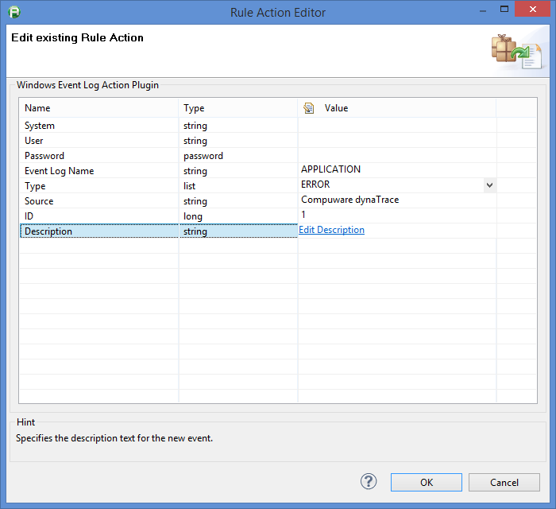
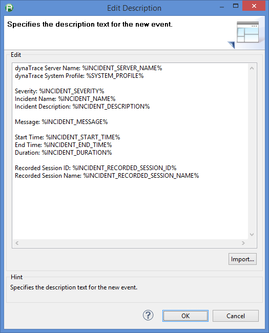
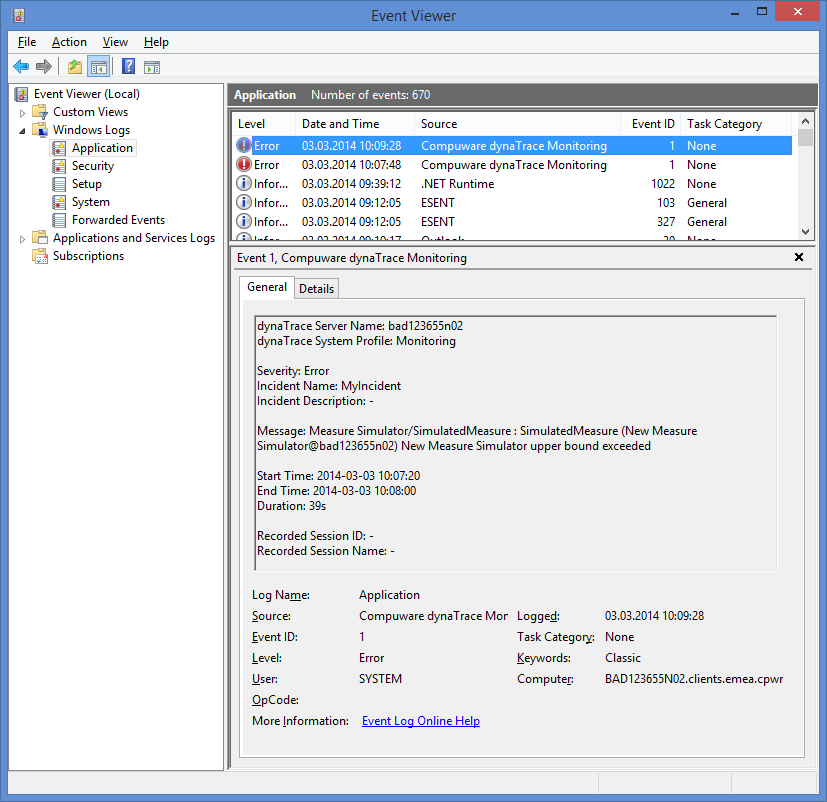

# Windows Event Log Action Plugin

## Overview

The Windows Event Log Action Plugin enables dynaTrace to forward incidents into the Microsoft Windows Event Log.The plugin is based on the Windows "eventcreate.exe" command and allows event creation
on local and remote machines.

## Plugin Details

| Name | Windows Event Log Action Plugin
| :--- | :---
| Author | Christian Grimm ([christian.grimm@compuware.com](mailto:christian.grimm@compuware.com))
| Supported dynaTrace Versions | >= 5.5
| License | [dynaTrace BSD](dynaTraceBSD.txt)
| Support | [Not Supported](https://community.compuwareapm.com/community/display/DL/Support+Levels)
| Release History | 2014-03-03 Initial Release  
| | 2014-03-04 Backward Compatibility for dynaTrace 5.5
| Download | [dynaTrace Windows Event Log Action Plugin 0.8.1](com.compuwareapm.community.plugin.windowseventlogaction_0.8.1.jar)

## Installation

Import the Plugin into the dynaTrace Server. For details how to do this please refer to the [Online Documentation on Plugin Management](https://community.compuwareapm.com/community/display/DOCDT61/Plugin+Management).

## Configuration

The following screenshot shows an example configuration:

**System:**  
Optional. Specifies the remote system to connect to.

**User:**  
Optional. [domain\\]user specifies the user context under which the command should execute.

**Password:**  
Optional. Specifies the password for the given user context.

**Event Log Name:**  
Specifies the event log to create an event in.

**Type:**  
Specifies the type of event to create. Valid types: SUCCESS, ERROR, WARNING, INFORMATION.

**Source:**  
Specifies the source to use for the event (if not specified, source will default to 'eventcreate'). A valid source can be any string and should represent the application or component that is
generating the event.

**ID:**  
Specifies the event ID for the event. A valid custom message ID is in the range of 1 - 1000.

**Description:**  
Specifies the description text for the new event. Variables can be used for dynamic text. Examle:

## Example Windows Event Log

## Troubleshooting

Please refer to the log file, which contains the full console output of the Windows Event Log Action Plugin:  
%dynaTraceInstallation%/log/server/com.compuwareapm.community.plugin.WindowsEventLogAction.action.0.0.log

## Feedback

Please provide feedback on this plugin either by commenting on this page or by comments on the [Community Plugins and Extensions](https://community/display/DTFORUM/Community+Plugins+and+Extensions)

